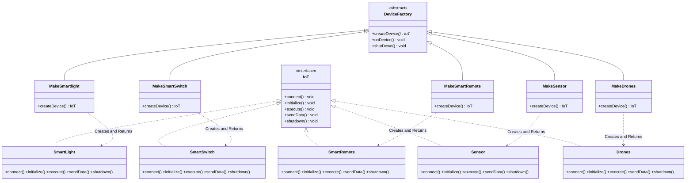

# Factory Method Pattern

```mermaid
classDiagram
    class IoT {
        <<interface>>
        +connect() void
        +initialize() void
        +execute() void
        +sendData() void
        +shutdown() void
    }

    class SmartLight { +connect() +initialize() +execute() +sendData() +shutdown() }
    class SmartSwitch { +connect() +initialize() +execute() +sendData() +shutdown() }
    class SmartRemote { +connect() +initialize() +execute() +sendData() +shutdown() }
    class Sensor { +connect() +initialize() +execute() +sendData() +shutdown() }
    class Drones { +connect() +initialize() +execute() +sendData() +shutdown() }

    IoT <|.. SmartLight
    IoT <|.. SmartSwitch
    IoT <|.. SmartRemote
    IoT <|.. Sensor
    IoT <|.. Drones

    class DeviceFactory {
        <<abstract>>
        +createDevice()* IoT
        +onDevice() void
        +shutDown() void
    }

    class MakeSmartlight { +createDevice() IoT }
    class MakeSmartSwitch { +createDevice() IoT }
    class MakeSmartRemote { +createDevice() IoT }
    class MakeSensor { +createDevice() IoT }
    class MakeDrones { +createDevice() IoT }

    DeviceFactory <|-- MakeSmartlight
    DeviceFactory <|-- MakeSmartSwitch
    DeviceFactory <|-- MakeSmartRemote
    DeviceFactory <|-- MakeSensor
    DeviceFactory <|-- MakeDrones

    MakeSmartlight ..> SmartLight : Creates and Returns
    MakeSmartSwitch ..> SmartSwitch : Creates and Returns
    MakeSmartRemote ..> SmartRemote : Creates and Returns
    MakeSensor ..> Sensor : Creates and Returns
    MakeDrones ..> Drones : Creates and Returns
```
