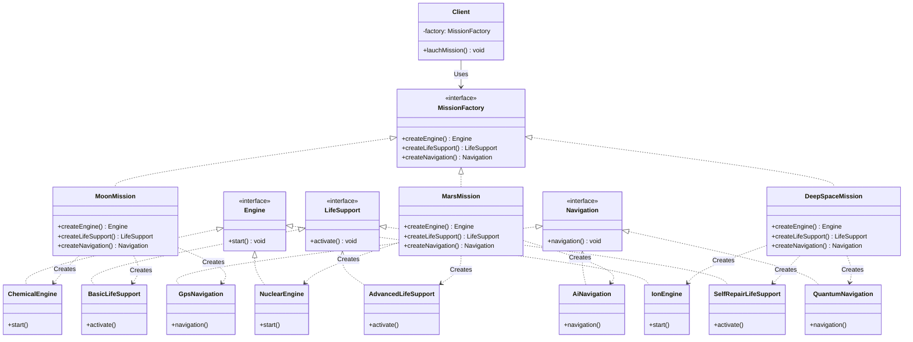

# Abstract Factory Pattern

```mermaid
classDiagram
    class MissionFactory {
        <<interface>>
        +createEngine() Engine
        +createLifeSupport() LifeSupport
        +createNavigation() Navigation
    }
    class MoonMission {
        +createEngine() Engine
        +createLifeSupport() LifeSupport
        +createNavigation() Navigation
    }
    class MarsMission {
        +createEngine() Engine
        +createLifeSupport() LifeSupport
        +createNavigation() Navigation
    }
    class DeepSpaceMission {
        +createEngine() Engine
        +createLifeSupport() LifeSupport
        +createNavigation() Navigation
    }
    
    MissionFactory <|.. MoonMission
    MissionFactory <|.. MarsMission
    MissionFactory <|.. DeepSpaceMission

    class Engine {
        <<interface>>
        +start() void
    }
    class ChemicalEngine { +start() }
    class NuclearEngine { +start() }
    class IonEngine { +start() }
    Engine <|.. ChemicalEngine
    Engine <|.. NuclearEngine
    Engine <|.. IonEngine

    class LifeSupport {
        <<interface>>
        +activate() void
    }
    class BasicLifeSupport { +activate() }
    class AdvancedLifeSupport { +activate() }
    class SelfRepairLifeSupport { +activate() }
    LifeSupport <|.. BasicLifeSupport
    LifeSupport <|.. AdvancedLifeSupport
    LifeSupport <|.. SelfRepairLifeSupport

    class Navigation {
        <<interface>>
        +navigation() void
    }
    class GpsNavigation { +navigation() }
    class AiNavigation { +navigation() }
    class QuantumNavigation { +navigation() }
    Navigation <|.. GpsNavigation
    Navigation <|.. AiNavigation
    Navigation <|.. QuantumNavigation

    MoonMission ..> ChemicalEngine : Creates
    MoonMission ..> BasicLifeSupport : Creates
    MoonMission ..> GpsNavigation : Creates
    
    MarsMission ..> NuclearEngine : Creates
    MarsMission ..> AdvancedLifeSupport : Creates
    MarsMission ..> AiNavigation : Creates
    
    DeepSpaceMission ..> IonEngine : Creates
    DeepSpaceMission ..> SelfRepairLifeSupport : Creates
    DeepSpaceMission ..> QuantumNavigation : Creates

    class Client {
        -factory: MissionFactory
        +lauchMission() void
    }
    Client --> MissionFactory : Uses
```
