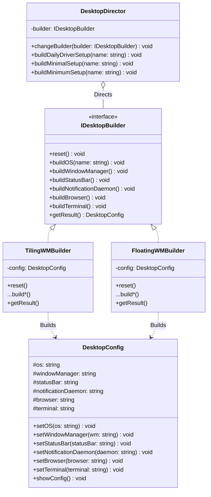

# Builder Pattern

```mermaid
classDiagram
    class DesktopConfig {
        #os: string
        #windowManager: string
        #statusBar: string
        #notificationDaemon: string
        #browser: string
        #terminal: string
        +setOS(os: string) void
        +setWindowManager(wm: string) void
        +setStatusBar(statusBar: string) void
        +setNotificationDaemon(daemon: string) void
        +setBrowser(browser: string) void
        +setTerminal(terminal: string) void
        +showConfig() void
    }

    class IDesktopBuilder {
        <<interface>>
        +reset() void
        +buildOS(name: string) void
        +buildWindowManager() void
        +buildStatusBar() void
        +buildNotificationDaemon() void
        +buildBrowser() void
        +buildTerminal() void
        +getResult() DesktopConfig
    }

    class TilingWMBuilder {
        -config: DesktopConfig
        +reset()
        ...build*()
        +getResult()
    }
    class FloatingWMBuilder {
        -config: DesktopConfig
        +reset()
        ...build*()
        +getResult()
    }

    IDesktopBuilder <|.. TilingWMBuilder
    IDesktopBuilder <|.. FloatingWMBuilder

    TilingWMBuilder ..> DesktopConfig : Builds
    FloatingWMBuilder ..> DesktopConfig : Builds

    class DesktopDirector {
        -builder: IDesktopBuilder
        +changeBuilder(builder: IDesktopBuilder) void
        +buildDailyDriverSetup(name: string) void
        +buildMinimalSetup(name: string) void
        +buildMinimumSetup(name: string) void
    }

    DesktopDirector o-- IDesktopBuilder : Directs
```
