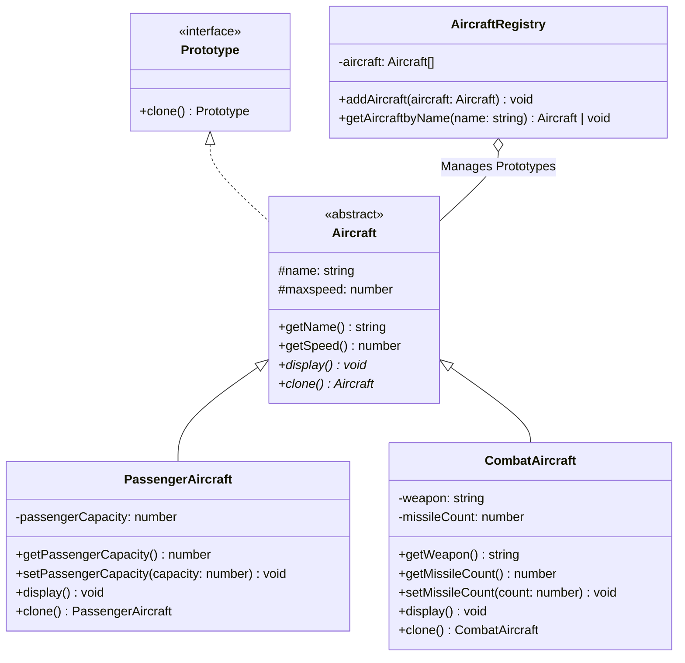

# Prototype Pattern

```mermaid
classDiagram
    class Prototype {
        <<interface>>
        +clone() Prototype
    }

    class Aircraft {
        <<abstract>>
        #name: string
        #maxspeed: number
        +getName() string
        +getSpeed() number
        +display()* void
        +clone()* Aircraft
    }

    Prototype <|.. Aircraft

    class PassengerAircraft {
        -passengerCapacity: number
        +getPassengerCapacity() number
        +setPassengerCapacity(capacity: number) void
        +display() void
        +clone() PassengerAircraft
    }
    
    class CombatAircraft {
        -weapon: string
        -missileCount: number
        +getWeapon() string
        +getMissileCount() number
        +setMissileCount(count: number) void
        +display() void
        +clone() CombatAircraft
    }

    Aircraft <|-- PassengerAircraft
    Aircraft <|-- CombatAircraft

    class AircraftRegistry {
        -aircraft: Aircraft[]
        +addAircraft(aircraft: Aircraft) void
        +getAircraftbyName(name: string) Aircraft | void
    }

    AircraftRegistry o-- Aircraft : Manages Prototypes
```
