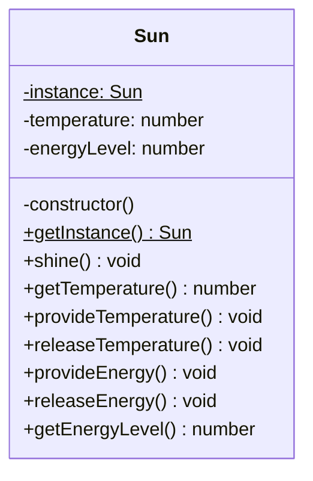

# Singleton Pattern

```mermaid
classDiagram
    class Sun {
        -instance: Sun$
        -temperature: number
        -energyLevel: number
        -constructor()
        +getInstance()$ Sun
        +shine() void
        +getTemperature() number
        +provideTemperature() void
        +releaseTemperature() void
        +provideEnergy() void
        +releaseEnergy() void
        +getEnergyLevel() number
    }
```
