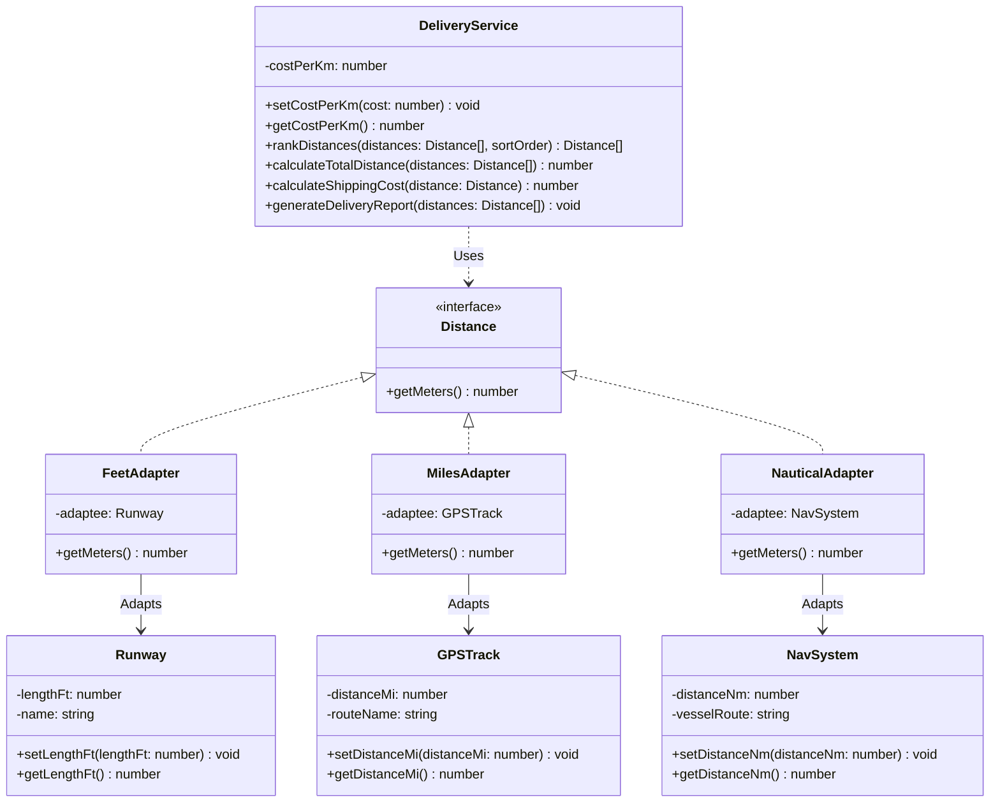

# Adapter Pattern

```mermaid
classDiagram
    class Distance {
        <<interface>>
        +getMeters() number
    }

    class DeliveryService {
        -costPerKm: number
        +setCostPerKm(cost: number) void
        +getCostPerKm() number
        +rankDistances(distances: Distance[], sortOrder) Distance[]
        +calculateTotalDistance(distances: Distance[]) number
        +calculateShippingCost(distance: Distance) number
        +generateDeliveryReport(distances: Distance[]) void
    }

    DeliveryService ..> Distance : Uses

    class Runway {
        -lengthFt: number
        -name: string
        +setLengthFt(lengthFt: number) void
        +getLengthFt() number
    }

    class GPSTrack {
        -distanceMi: number
        -routeName: string
        +setDistanceMi(distanceMi: number) void
        +getDistanceMi() number
    }

    class NavSystem {
        -distanceNm: number
        -vesselRoute: string
        +setDistanceNm(distanceNm: number) void
        +getDistanceNm() number
    }

    class FeetAdapter {
        -adaptee: Runway
        +getMeters() number
    }

    class MilesAdapter {
        -adaptee: GPSTrack
        +getMeters() number
    }

    class NauticalAdapter {
        -adaptee: NavSystem
        +getMeters() number
    }

    Distance <|.. FeetAdapter
    Distance <|.. MilesAdapter
    Distance <|.. NauticalAdapter

    FeetAdapter --> Runway : Adapts
    MilesAdapter --> GPSTrack : Adapts
    NauticalAdapter --> NavSystem : Adapts
```
