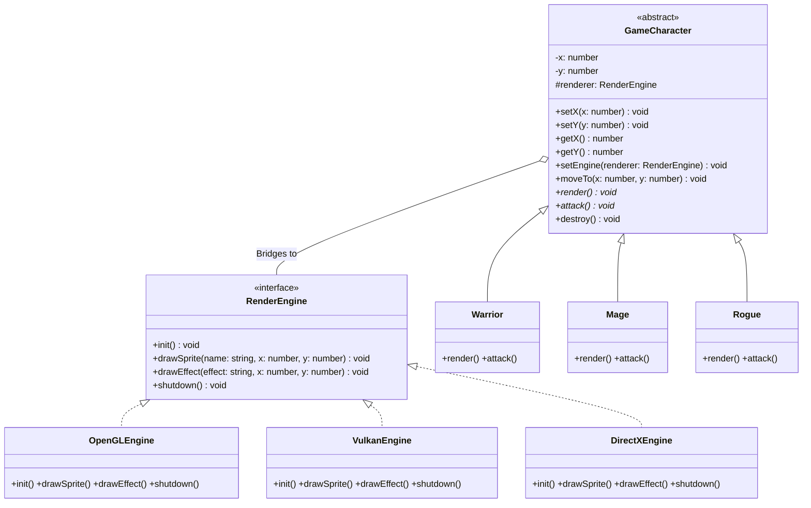

# Bridge Pattern

```mermaid
classDiagram
    class RenderEngine {
        <<interface>>
        +init() void
        +drawSprite(name: string, x: number, y: number) void
        +drawEffect(effect: string, x: number, y: number) void
        +shutdown() void
    }

    class OpenGLEngine { +init() +drawSprite() +drawEffect() +shutdown() }
    class VulkanEngine { +init() +drawSprite() +drawEffect() +shutdown() }
    class DirectXEngine { +init() +drawSprite() +drawEffect() +shutdown() }

    RenderEngine <|.. OpenGLEngine
    RenderEngine <|.. VulkanEngine
    RenderEngine <|.. DirectXEngine

    class GameCharacter {
        <<abstract>>
        -x: number
        -y: number
        #renderer: RenderEngine
        +setX(x: number) void
        +setY(y: number) void
        +getX() number
        +getY() number
        +setEngine(renderer: RenderEngine) void
        +moveTo(x: number, y: number) void
        +render()* void
        +attack()* void
        +destroy() void
    }

    class Warrior { +render() +attack() }
    class Mage { +render() +attack() }
    class Rogue { +render() +attack() }

    GameCharacter <|-- Warrior
    GameCharacter <|-- Mage
    GameCharacter <|-- Rogue

    GameCharacter o-- RenderEngine : Bridges to
```
