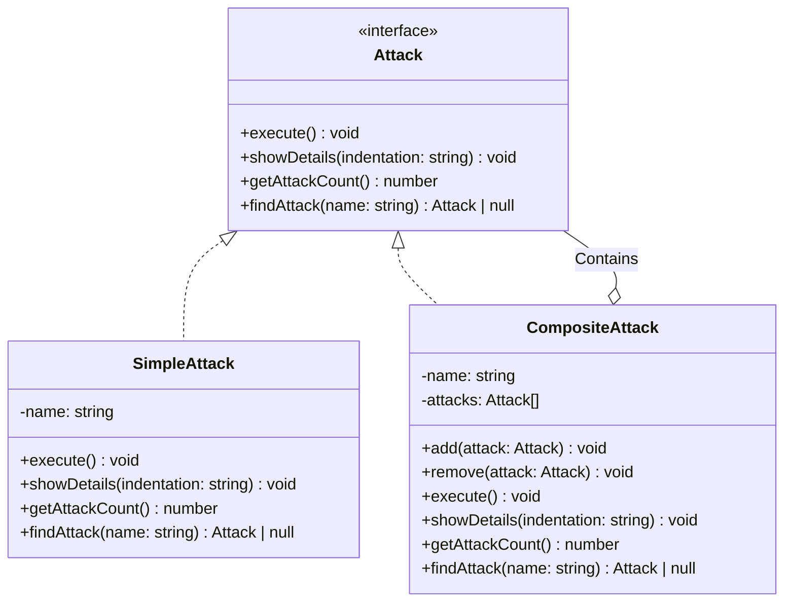

# Composite Pattern

```mermaid
classDiagram
    class Attack {
        <<interface>>
        +execute() void
        +showDetails(indentation: string) void
        +getAttackCount() number
        +findAttack(name: string) Attack | null
    }

    class SimpleAttack {
        -name: string
        +execute() void
        +showDetails(indentation: string) void
        +getAttackCount() number
        +findAttack(name: string) Attack | null
    }

    class CompositeAttack {
        -name: string
        -attacks: Attack[]
        +add(attack: Attack) void
        +remove(attack: Attack) void
        +execute() void
        +showDetails(indentation: string) void
        +getAttackCount() number
        +findAttack(name: string) Attack | null
    }

    Attack <|.. SimpleAttack
    Attack <|.. CompositeAttack

    CompositeAttack o-- Attack : Contains
```
