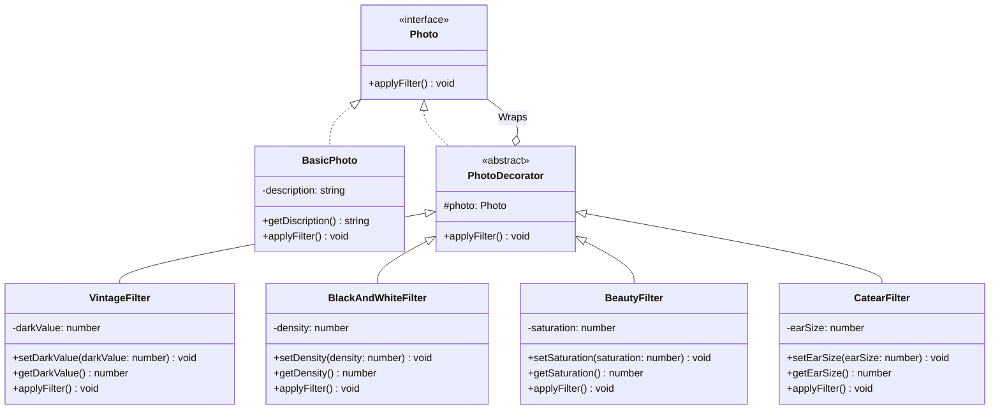

# Decorator Pattern

```mermaid
classDiagram
    class Photo {
        <<interface>>
        +applyFilter() void
    }

    class BasicPhoto {
        -description: string
        +getDiscription() string
        +applyFilter() void
    }

    class PhotoDecorator {
        <<abstract>>
        #photo: Photo
        +applyFilter() void
    }

    Photo <|.. BasicPhoto
    Photo <|.. PhotoDecorator

    PhotoDecorator o-- Photo : Wraps

    class VintageFilter {
        -darkValue: number
        +setDarkValue(darkValue: number) void
        +getDarkValue() number
        +applyFilter() void
    }
    
    class BlackAndWhiteFilter {
        -density: number
        +setDensity(density: number) void
        +getDensity() number
        +applyFilter() void
    }
    
    class BeautyFilter {
        -saturation: number
        +setSaturation(saturation: number) void
        +getSaturation() number
        +applyFilter() void
    }
    
    class CatearFilter {
        -earSize: number
        +setEarSize(earSize: number) void
        +getEarSize() number
        +applyFilter() void
    }

    PhotoDecorator <|-- VintageFilter
    PhotoDecorator <|-- BlackAndWhiteFilter
    PhotoDecorator <|-- BeautyFilter
    PhotoDecorator <|-- CatearFilter
```
