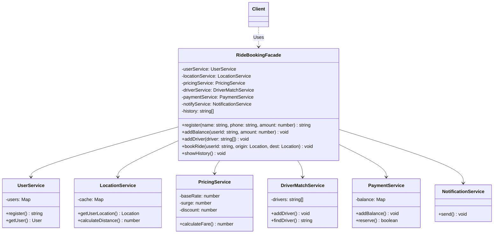

# Facade Pattern

```mermaid
classDiagram
    class RideBookingFacade {
        -userService: UserService
        -locationService: LocationService
        -pricingService: PricingService
        -driverService: DriverMatchService
        -paymentService: PaymentService
        -notifyService: NotificationService
        -history: string[]
        +register(name: string, phone: string, amount: number) string
        +addBalance(userId: string, amount: number) void
        +addDriver(driver: string[]) void
        +bookRide(userId: string, origin: Location, dest: Location) void
        +showHistory() void
    }

    class UserService { 
        -users: Map
        +register() string
        +getUser() User
    }
    class LocationService { 
        -cache: Map
        +getUserLocation() Location
        +calculateDistance() number
    }
    class PricingService { 
        -baseRate: number
        -surge: number
        -discount: number
        +calculateFare() number
    }
    class DriverMatchService { 
        -drivers: string[]
        +addDriver() void
        +findDriver() string
    }
    class PaymentService { 
        -balance: Map
        +addBalance() void
        +reserve() boolean
    }
    class NotificationService { 
        +send() void
    }

    RideBookingFacade --> UserService
    RideBookingFacade --> LocationService
    RideBookingFacade --> PricingService
    RideBookingFacade --> DriverMatchService
    RideBookingFacade --> PaymentService
    RideBookingFacade --> NotificationService

    class Client { }
    Client ..> RideBookingFacade : Uses
```
