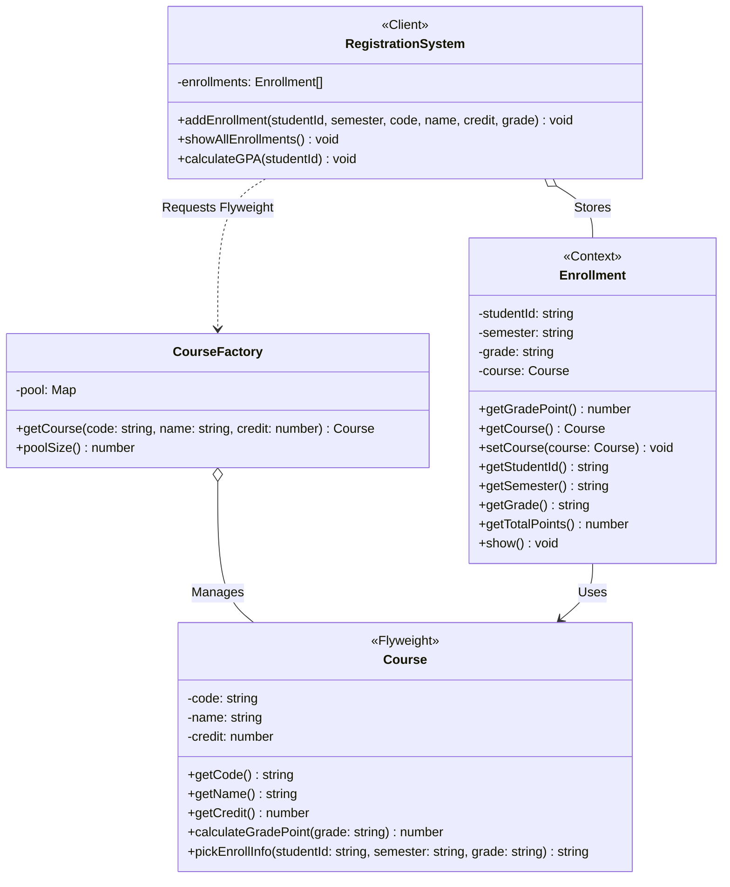

# Flyweight Pattern

```mermaid
classDiagram
    class CourseFactory {
        -pool: Map
        +getCourse(code: string, name: string, credit: number) Course
        +poolSize() number
    }

    class Course {
        <<Flyweight>>
        -code: string
        -name: string
        -credit: number
        +getCode() string
        +getName() string
        +getCredit() number
        +calculateGradePoint(grade: string) number
        +pickEnrollInfo(studentId: string, semester: string, grade: string) string
    }

    CourseFactory o-- Course : Manages

    class Enrollment {
        <<Context>>
        -studentId: string
        -semester: string
        -grade: string
        -course: Course
        +getGradePoint() number
        +getCourse() Course
        +setCourse(course: Course) void
        +getStudentId() string
        +getSemester() string
        +getGrade() string
        +getTotalPoints() number
        +show() void
    }

    Enrollment --> Course : Uses

    class RegistrationSystem {
        <<Client>>
        -enrollments: Enrollment[]
        +addEnrollment(studentId, semester, code, name, credit, grade) void
        +showAllEnrollments() void
        +calculateGPA(studentId) void
    }

    RegistrationSystem o-- Enrollment : Stores
    RegistrationSystem ..> CourseFactory : Requests Flyweight
```
