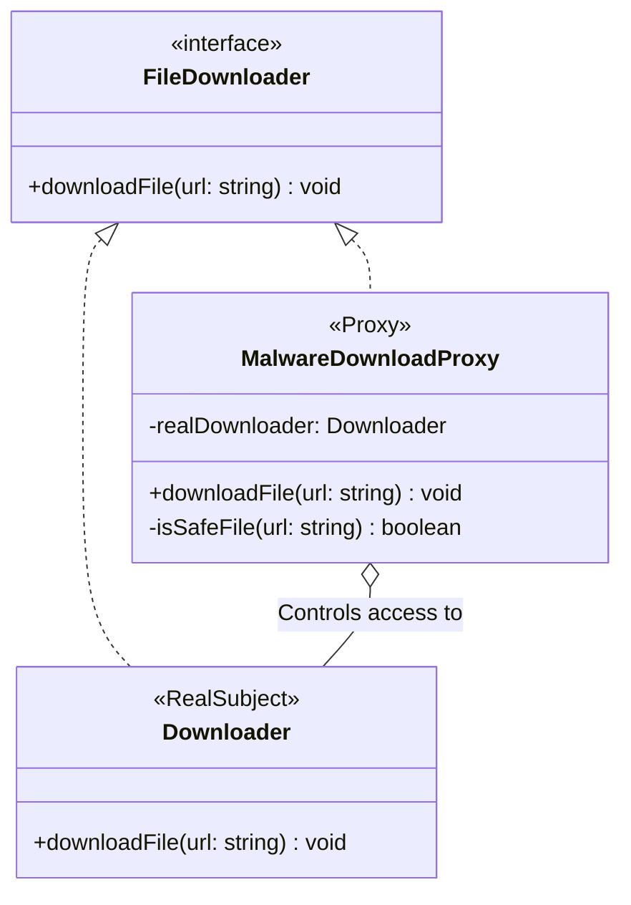

# Proxy Pattern

```mermaid
classDiagram
    class FileDownloader {
        <<interface>>
        +downloadFile(url: string) void
    }

    class Downloader {
        <<RealSubject>>
        +downloadFile(url: string) void
    }

    class MalwareDownloadProxy {
        <<Proxy>>
        -realDownloader: Downloader
        +downloadFile(url: string) void
        -isSafeFile(url: string) boolean
    }

    FileDownloader <|.. Downloader
    FileDownloader <|.. MalwareDownloadProxy

    MalwareDownloadProxy o-- Downloader : Controls access to
```
