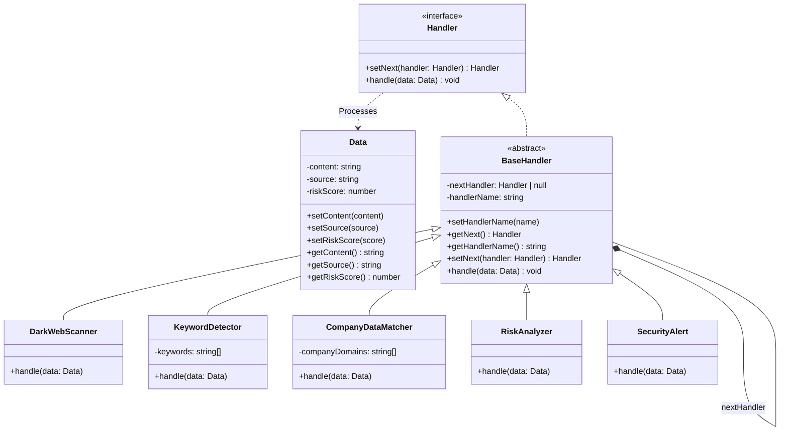

# Chain of Responsibility (COR) Pattern

```mermaid
classDiagram
    class Data {
        -content: string
        -source: string
        -riskScore: number
        +setContent(content)
        +setSource(source)
        +setRiskScore(score)
        +getContent() string
        +getSource() string
        +getRiskScore() number
    }

    class Handler {
        <<interface>>
        +setNext(handler: Handler) Handler
        +handle(data: Data) void
    }

    class BaseHandler {
        <<abstract>>
        -nextHandler: Handler | null
        -handlerName: string
        +setHandlerName(name)
        +getNext() Handler
        +getHandlerName() string
        +setNext(handler: Handler) Handler
        +handle(data: Data) void
    }

    Handler <|.. BaseHandler

    class DarkWebScanner { +handle(data: Data) }
    class KeywordDetector { 
        -keywords: string[] 
        +handle(data: Data) 
    }
    class CompanyDataMatcher { 
        -companyDomains: string[] 
        +handle(data: Data) 
    }
    class RiskAnalyzer { +handle(data: Data) }
    class SecurityAlert { +handle(data: Data) }

    BaseHandler <|-- DarkWebScanner
    BaseHandler <|-- KeywordDetector
    BaseHandler <|-- CompanyDataMatcher
    BaseHandler <|-- RiskAnalyzer
    BaseHandler <|-- SecurityAlert

    BaseHandler *-- BaseHandler : nextHandler

    Handler ..> Data : Processes
```
