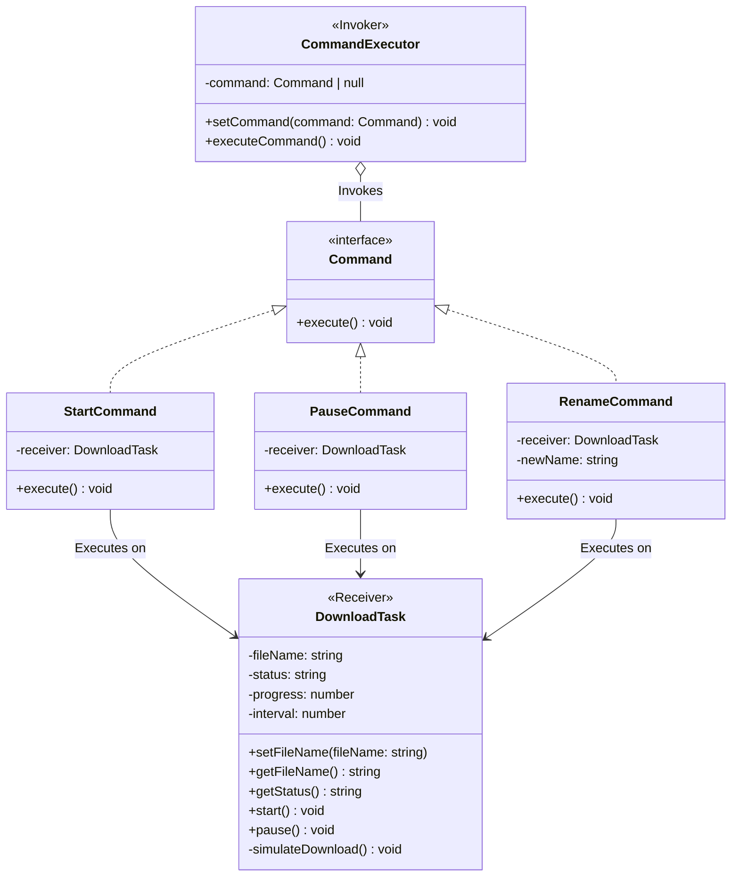

# Command Pattern

```mermaid
classDiagram
    class DownloadTask {
        <<Receiver>>
        -fileName: string
        -status: string
        -progress: number
        -interval: number
        +setFileName(fileName: string)
        +getFileName() string
        +getStatus() string
        +start() void
        +pause() void
        -simulateDownload() void
    }

    class Command {
        <<interface>>
        +execute() void
    }

    class StartCommand {
        -receiver: DownloadTask
        +execute() void
    }

    class PauseCommand {
        -receiver: DownloadTask
        +execute() void
    }

    class RenameCommand {
        -receiver: DownloadTask
        -newName: string
        +execute() void
    }

    Command <|.. StartCommand
    Command <|.. PauseCommand
    Command <|.. RenameCommand

    StartCommand --> DownloadTask : Executes on
    PauseCommand --> DownloadTask : Executes on
    RenameCommand --> DownloadTask : Executes on

    class CommandExecutor {
        <<Invoker>>
        -command: Command | null
        +setCommand(command: Command) void
        +executeCommand() void
    }

    CommandExecutor o-- Command : Invokes
```
