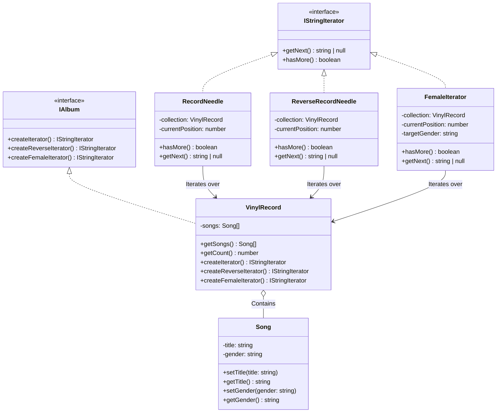

# Iterator Pattern

```mermaid
classDiagram
    class IStringIterator {
        <<interface>>
        +getNext() string | null
        +hasMore() boolean
    }

    class IAlbum {
        <<interface>>
        +createIterator() IStringIterator
        +createReverseIterator() IStringIterator
        +createFemaleIterator() IStringIterator
    }

    class Song {
        -title: string
        -gender: string
        +setTitle(title: string)
        +getTitle() string
        +setGender(gender: string)
        +getGender() string
    }

    class VinylRecord {
        -songs: Song[]
        +getSongs() Song[]
        +getCount() number
        +createIterator() IStringIterator
        +createReverseIterator() IStringIterator
        +createFemaleIterator() IStringIterator
    }

    IAlbum <|.. VinylRecord
    VinylRecord o-- Song : Contains

    class RecordNeedle {
        -collection: VinylRecord
        -currentPosition: number
        +hasMore() boolean
        +getNext() string | null
    }

    class ReverseRecordNeedle {
        -collection: VinylRecord
        -currentPosition: number
        +hasMore() boolean
        +getNext() string | null
    }

    class FemaleIterator {
        -collection: VinylRecord
        -currentPosition: number
        -targetGender: string
        +hasMore() boolean
        +getNext() string | null
    }

    IStringIterator <|.. RecordNeedle
    IStringIterator <|.. ReverseRecordNeedle
    IStringIterator <|.. FemaleIterator

    RecordNeedle --> VinylRecord : Iterates over
    ReverseRecordNeedle --> VinylRecord : Iterates over
    FemaleIterator --> VinylRecord : Iterates over
```
