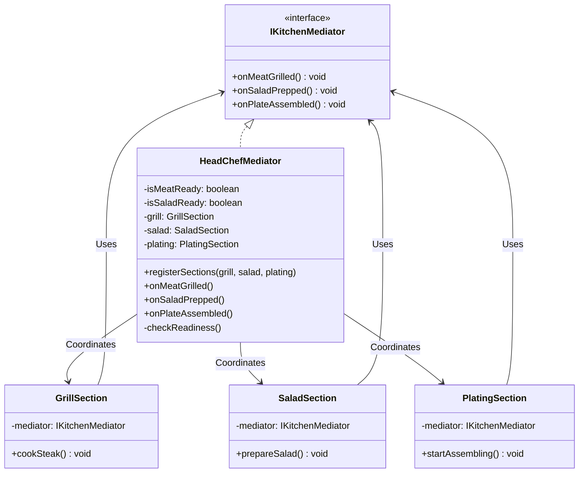

# Mediator Pattern

```mermaid
classDiagram
    class IKitchenMediator {
        <<interface>>
        +onMeatGrilled() void
        +onSaladPrepped() void
        +onPlateAssembled() void
    }

    class HeadChefMediator {
        -isMeatReady: boolean
        -isSaladReady: boolean
        -grill: GrillSection
        -salad: SaladSection
        -plating: PlatingSection
        +registerSections(grill, salad, plating)
        +onMeatGrilled()
        +onSaladPrepped()
        +onPlateAssembled()
        -checkReadiness()
    }

    IKitchenMediator <|.. HeadChefMediator

    class GrillSection {
        -mediator: IKitchenMediator
        +cookSteak() void
    }

    class SaladSection {
        -mediator: IKitchenMediator
        +prepareSalad() void
    }

    class PlatingSection {
        -mediator: IKitchenMediator
        +startAssembling() void
    }

    GrillSection --> IKitchenMediator : Uses
    SaladSection --> IKitchenMediator : Uses
    PlatingSection --> IKitchenMediator : Uses

    HeadChefMediator --> GrillSection : Coordinates
    HeadChefMediator --> SaladSection : Coordinates
    HeadChefMediator --> PlatingSection : Coordinates
```
