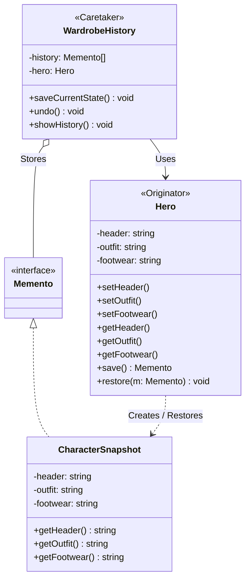

# Memento Pattern

```mermaid
classDiagram
    class Memento {
        <<interface>>
    }

    class CharacterSnapshot {
        -header: string
        -outfit: string
        -footwear: string
        +getHeader() string
        +getOutfit() string
        +getFootwear() string
    }

    Memento <|.. CharacterSnapshot

    class Hero {
        <<Originator>>
        -header: string
        -outfit: string
        -footwear: string
        +setHeader()
        +setOutfit()
        +setFootwear()
        +getHeader()
        +getOutfit()
        +getFootwear()
        +save() Memento
        +restore(m: Memento) void
    }

    Hero ..> CharacterSnapshot : Creates / Restores

    class WardrobeHistory {
        <<Caretaker>>
        -history: Memento[]
        -hero: Hero
        +saveCurrentState() void
        +undo() void
        +showHistory() void
    }

    WardrobeHistory o-- Memento : Stores
    WardrobeHistory --> Hero : Uses
```
