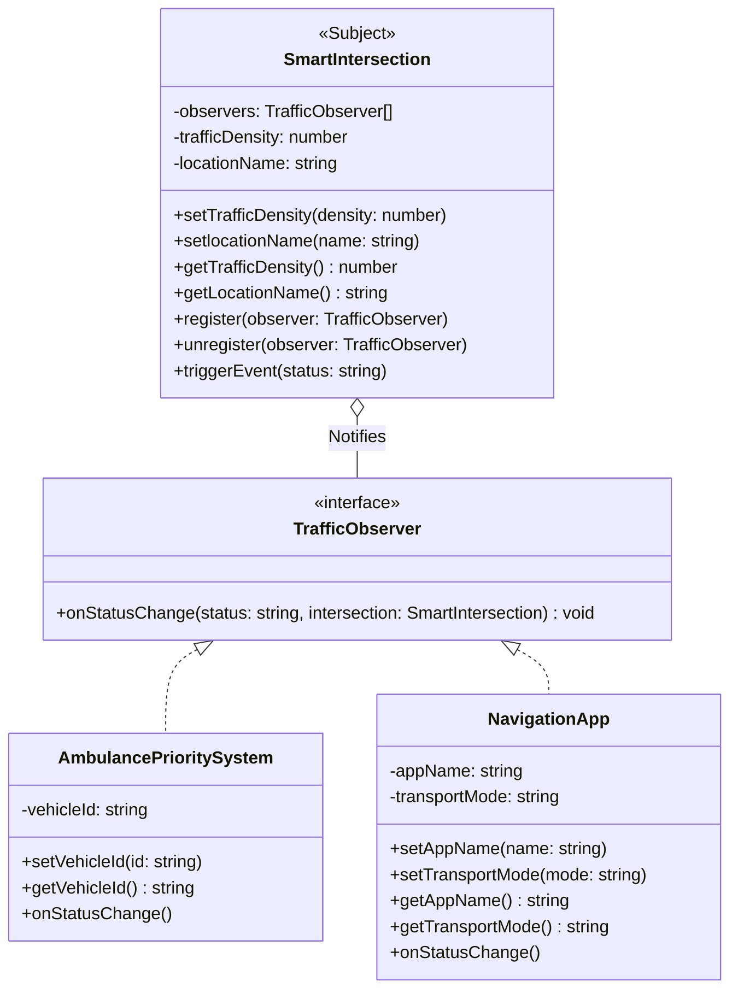

# Observer Pattern

```mermaid
classDiagram
    class TrafficObserver {
        <<interface>>
        +onStatusChange(status: string, intersection: SmartIntersection) void
    }

    class SmartIntersection {
        <<Subject>>
        -observers: TrafficObserver[]
        -trafficDensity: number
        -locationName: string
        +setTrafficDensity(density: number)
        +setlocationName(name: string)
        +getTrafficDensity() number
        +getLocationName() string
        +register(observer: TrafficObserver)
        +unregister(observer: TrafficObserver)
        +triggerEvent(status: string)
    }

    SmartIntersection o-- TrafficObserver : Notifies

    class AmbulancePrioritySystem {
        -vehicleId: string
        +setVehicleId(id: string)
        +getVehicleId() string
        +onStatusChange()
    }

    class NavigationApp {
        -appName: string
        -transportMode: string
        +setAppName(name: string)
        +setTransportMode(mode: string)
        +getAppName() string
        +getTransportMode() string
        +onStatusChange()
    }

    TrafficObserver <|.. AmbulancePrioritySystem
    TrafficObserver <|.. NavigationApp
```
