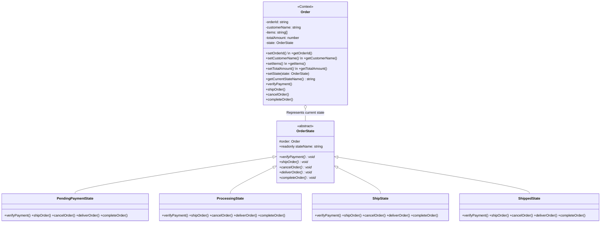

# State Pattern

```mermaid
classDiagram
    class OrderState {
        <<abstract>>
        #order: Order
        +readonly stateName: string
        +verifyPayment()* void
        +shipOrder()* void
        +cancelOrder()* void
        +deliverOrder()* void
        +completeOrder()* void
    }

    class Order {
        <<Context>>
        -orderId: string
        -customerName: string
        -items: string[]
        -totalAmount: number
        -state: OrderState
        +setOrderId() \n +getOrderId()
        +setCustomerName() \n +getCustomerName()
        +setItems() \n +getItems()
        +setTotalAmount() \n +getTotalAmount()
        +setState(state: OrderState)
        +getCurrentStateName() string
        +verifyPayment()
        +shipOrder()
        +cancelOrder()
        +completeOrder()
    }

    Order o-- OrderState : Represents current state

    class PendingPaymentState { +verifyPayment() +shipOrder() +cancelOrder() +deliverOrder() +completeOrder() }
    class ProcessingState { +verifyPayment() +shipOrder() +cancelOrder() +deliverOrder() +completeOrder() }
    class ShipState { +verifyPayment() +shipOrder() +cancelOrder() +deliverOrder() +completeOrder() }
    class ShippedState { +verifyPayment() +shipOrder() +cancelOrder() +deliverOrder() +completeOrder() }

    OrderState <|-- PendingPaymentState
    OrderState <|-- ProcessingState
    OrderState <|-- ShipState
    OrderState <|-- ShippedState
```
