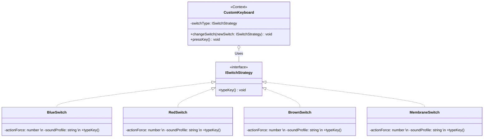

# Strategy Pattern

```mermaid
classDiagram
    class ISwitchStrategy {
        <<interface>>
        +typeKey() void
    }

    class BlueSwitch { -actionForce: number \n -soundProfile: string \n +typeKey() }
    class RedSwitch { -actionForce: number \n -soundProfile: string \n +typeKey() }
    class BrownSwitch { -actionForce: number \n -soundProfile: string \n +typeKey() }
    class MembraneSwitch { -actionForce: number \n -soundProfile: string \n +typeKey() }

    ISwitchStrategy <|.. BlueSwitch
    ISwitchStrategy <|.. RedSwitch
    ISwitchStrategy <|.. BrownSwitch
    ISwitchStrategy <|.. MembraneSwitch

    class CustomKeyboard {
        <<Context>>
        -switchType: ISwitchStrategy
        +changeSwitch(newSwitch: ISwitchStrategy) void
        +pressKey() void
    }

    CustomKeyboard o-- ISwitchStrategy : Uses
```
