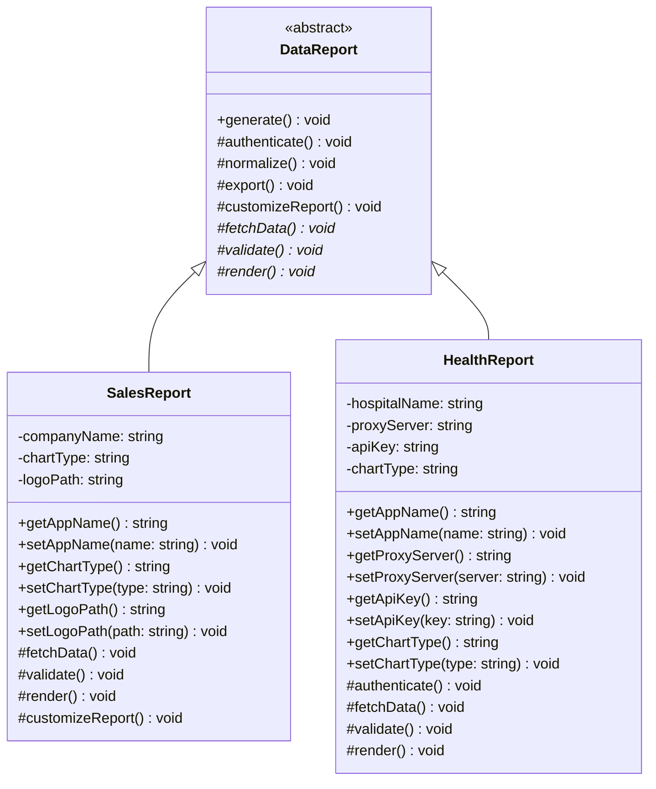

# Template Method Pattern

```mermaid
classDiagram
    class DataReport {
        <<abstract>>
        +generate() void
        #authenticate() void
        #normalize() void
        #export() void
        #customizeReport() void
        #fetchData()* void
        #validate()* void
        #render()* void
    }

    class SalesReport {
        -companyName: string
        -chartType: string
        -logoPath: string
        +getAppName() string
        +setAppName(name: string) void
        +getChartType() string
        +setChartType(type: string) void
        +getLogoPath() string
        +setLogoPath(path: string) void
        #fetchData() void
        #validate() void
        #render() void
        #customizeReport() void
    }

    class HealthReport {
        -hospitalName: string
        -proxyServer: string
        -apiKey: string
        -chartType: string
        +getAppName() string
        +setAppName(name: string) void
        +getProxyServer() string
        +setProxyServer(server: string) void
        +getApiKey() string
        +setApiKey(key: string) void
        +getChartType() string
        +setChartType(type: string) void
        #authenticate() void
        #fetchData() void
        #validate() void
        #render() void
    }

    DataReport <|-- SalesReport
    DataReport <|-- HealthReport
```
