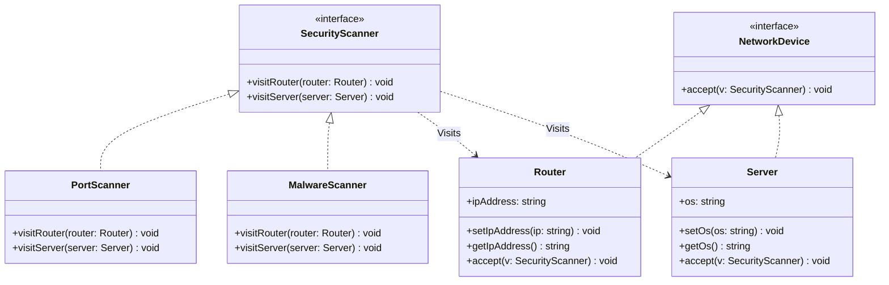

# Visitor Pattern

```mermaid
classDiagram
    class SecurityScanner {
        <<interface>>
        +visitRouter(router: Router) void
        +visitServer(server: Server) void
    }

    class PortScanner {
        +visitRouter(router: Router) void
        +visitServer(server: Server) void
    }

    class MalwareScanner {
        +visitRouter(router: Router) void
        +visitServer(server: Server) void
    }

    SecurityScanner <|.. PortScanner
    SecurityScanner <|.. MalwareScanner

    class NetworkDevice {
        <<interface>>
        +accept(v: SecurityScanner) void
    }

    class Router {
        +ipAddress: string
        +setIpAddress(ip: string) void
        +getIpAddress() string
        +accept(v: SecurityScanner) void
    }

    class Server {
        +os: string
        +setOs(os: string) void
        +getOs() string
        +accept(v: SecurityScanner) void
    }

    NetworkDevice <|.. Router
    NetworkDevice <|.. Server

    SecurityScanner ..> Router : Visits
    SecurityScanner ..> Server : Visits
```
