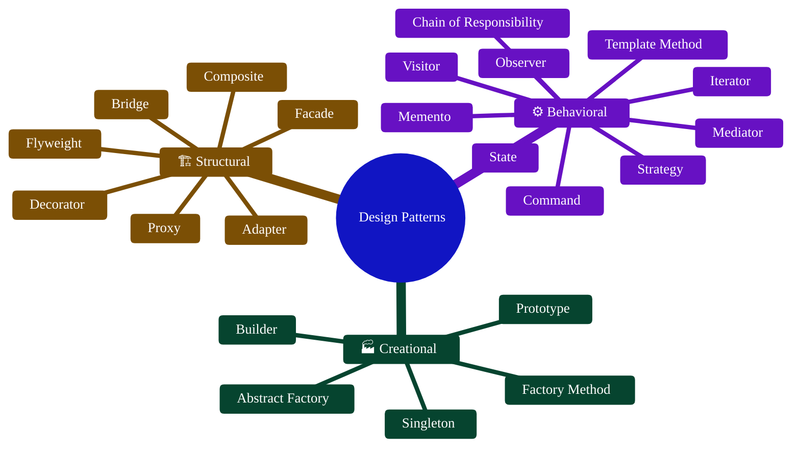

# 🎨 Design Patterns in TypeScript (COS4311)

Welcome to the **Design Patterns** repository! This project serves as a comprehensive collection of classic software design patterns implemented in **TypeScript**. It is designed to be a learning resource and a reference guide for building scalable, maintainable, and robust applications.

---

## 🚀 Getting Started

Ensure you have [Node.js](https://nodejs.org/) installed. Clone the repository and install the dependencies to get started:

```bash
git clone https://github.com/Seen1231028/Design-Patterns.git
cd Design-Patterns
npm install
```

To run a specific pattern, you can use `ts-node` (or execute the compiled JS files):
```bash
npx ts-node <pattern-folder>/index.ts
```

---

## 📚 Supported Patterns

Here are the design patterns implemented in this repository, categorized by their structural types:



### 🏭 Creational Patterns
These patterns deal with object creation mechanisms, trying to create objects in a manner suitable to the situation.
- [x] [01. Factory Method](./01-FactoryMethod)
- [x] [02. Abstract Factory](./02-AbstractFactory)
- [x] [03. Builder](./03-builder)
- [x] [04. Prototype](./04-Prototype)
- [x] [05. Singleton](./05-Signleton)

### 🏗️ Structural Patterns
These patterns explain how to assemble objects and classes into larger structures while keeping these structures flexible and efficient.
- [x] [06. Adapter](./06-Adapter)
- [x] [07. Bridge](./07-Bridge)
- [x] [08. Composite](./08-Composite)
- [x] [09. Decorator](./09-Decorator)
- [x] [10. Facade](./10-Facade)
- [x] [11. Flyweight](./11-Flyweight)
- [x] [12. Proxy](./12-Proxy)

### ⚙️ Behavioral Patterns
These patterns are concerned with algorithms and the assignment of responsibilities between objects.
- [x] [13. Chain of Responsibility (COR)](./13-COR)
- [x] [14. Command](./14-Command)
- [x] [15. Iterator](./15-Iterator)
- [ ] [16. Mediator](./16-Mediator)
- [x] [17. Memento](./17-Memento)
- [x] [18. Observer](./18-Observer)
- [ ] [19. State](./19-State)
- [x] [20. Strategy](./20-Strategy)
- [x] [21. Template Method](./21-Template-Method)
- [x] [22. Visitor](./22-Visitor)

---

## 🛠️ Technology Stack
- **TypeScript**: Typed programming language that builds on JavaScript.
- **Node.js**: JavaScript runtime environment.

## 🤝 Contributing
Contributions, issues, and feature requests are welcome! Feel free to explore the code, test it out, and open an issue if you find any bugs.

## 📝 License
This project is open-source and free to adapt.

> *“Design patterns are a template for how to solve a problem that can be used in many different situations.”*
